# Dentscape's Best Practices for Engineering

This repository demonstrates best practices for project documentation, development workflows, and AI-assisted tools used across Dentscape projects.

## Table of Contents

- General Concepts
  - [Polyrepo Approach](#polyrepo-approach)
  - [Documentation and Maintainability](#documentation-and-maintainability)
  - [Consistency of Development](#consistency-of-development)
- [Git Flow](#git-flow)
  - [`AIDirect/flask-server`](#aidirectflaskserver)
  - [`AIDirect/dental3d`](#aidirectdental3d)
  - [General Branch Naming Conventions](#general-branch-naming-conventions)
- [Tool Setup](#tool-setup)
  - [IDE / Editor Setup](#ide--editor-setup)
  - [Pre-commit Hooks (Linters, Formatters, Type Checking, Pytest)](#precommit-hooks-linters-formatters-type-checking-pytest)
  - [UV (Python Environment)](#uv-python-environment)
  - [AI Tools](#ai-tools)

## Polyrepo Approach

Dentscape employs a [polyrepo](https://github.com/joelparkerhenderson/monorepo-vs-polyrepo?tab=readme-ov-file#what-is-polyrepo) strategy to maintain modular, independently versioned components:

### Main Repositories

- [`AIDirect/flask-server`](https://github.com/AIDirect/flask-server): This is the backend repository to wrap backend implementations
  - Full-stack React + Flask app: front-end in `src/`, and Flask back-end under `api/`.
  - Modular APIs for dental image tasks (`beautify_smile`, `smile_care`, `ortho_2d`, `restoration_3d`, etc.).
  - Asynchronous 3D jobs via Celery + Redis and Firestore logging with Slack alerts.
  - Deployable to GCP App Engine (`app.yaml`) or AWS/ECR via provided Dockerfiles.
  - Uses UV/pyproject.toml for Python deps (Torch, Mediapipe, Open3D…) and Yarn for JS deps; includes setup/test scripts.
- [`AIDirect/dental3d`](https://github.com/AIDirect/dental3d): Core API implementation library.
  - Segmentation & landmarking pipelines
    - 3D tooth segmentation, abutment classification and per‐tooth landmark detection (PyTorch back‐ends)
  - Crown & splint generation applications
    - Automated crown‐shape optimization, mockup and Boolean‐based workflows
    - Splint design pipelines for occlusal appliances
  - Mesh utilities & file converters
    - Tools to convert 3Shape DCM exports to OBJ/PLY/STL (Note the preferred way to manipulate 3Shape DCMs are now [`AIDirect/py-clr`](https://github.com/AIDirect/py-clr))
    - Mesh‐I/O, template meshes, deformation (CPD), smoothing, hole‐filling, etc (Note that this is being moved to [`AIDirect/dentscape-core`](https://github.com/AIDirect/dentscape-core))
  - Bulk data & GCP integration
    - Batch‐processing scripts, GCP upload/download helpers
  - Example apps & tests
    - Sample inference scripts, end-to-end pipelines under `applications/`, smoke tests

### Supporting Libraries

- [`AIDirect/dentscape-core`](https://github.com/AIDirect/dentscape-core): Mesh operations, AI inference, Apache Beam integration.
- [`AIDirect/3d_data_pipeline`](https://github.com/AIDirect/3d_data_pipeline): Dataset preparation for AI models.
- [`AIDirect/py-clr`](https://github.com/AIDirect/py-clr): Python bindings for 3shape DLLs.

## Documentation and Maintainability

- Write concise, self-explanatory code; avoid excessive inline comments.
  “Good docs are clear and to the point.”
  <a href="https://www.youtube.com/watch?v=Bf7vDBBOBUA" target="_blank">
    
  </a>
- Add docstrings and type annotations
  - For Python, follow the [Google Python Style Guide](https://google.github.io/styleguide/pyguide.html).
- Always write [README](#readme) and [git commit messages](#git-commit-messages)!
  Use AI tools to help you in the process when necessary.
  See sections below.

### README

- Include project overview, installation instructions, usage examples, and contribution guidelines.
- Using AI tools to draft and iterate on documentation can be very helpful.
- Good example: [`AIDirect/py-clr:README.md`](https://github.com/AIDirect/py-clr/blob/main/README.md)

#### Reference Prompt for README Generation ([`README_GENERATION_PROMPT.md`](README_GENERATION_PROMPT.md))

Use the following prompt with OpenAI Codex to generate a README file.

```md
You are an AI assistant with full access to the codebase at the repository root. Your task is to generate a complete, well-structured README.md file that follows open-source best practices. The README might include the following sections, but they are not all mandatory. Use your judgment to include only the most relevant sections based on the codebase content.

1. **Project Title and Badges**
2. **One-Sentence Tagline**
3. **Overview / Description** – What the project does and why it exists.
4. **Table of Contents** with links to each major section.
5. **Installation** – Step-by-step instructions for setup, including prerequisites and commands.
6. **Usage** – Examples and common workflows, with code snippets.
7. **Configuration** – Any environment variables or settings.
8. **API / CLI Reference** – Key commands, endpoints, or functions.
9. **Examples** – Minimal working examples or links to demos.
10. **Testing** – How to run the test suite.
11. **Contributing** – Guidelines for submitting issues and pull requests, code style, and branch strategy.
12. **Roadmap** – Planned features or future work.
13. **Authors and Acknowledgments**
14. **License** – SPDX identifier and link to the full license text.
15. **Contact / Support** – How to get help or report bugs.

Write the README in Markdown, with clear section headings, concise text, and fenced code blocks where appropriate. Ensure all links and examples are syntactically correct.
```

### Git Commit Messages

Use Gitmoji-style commit messages.
Gitmoji is a convention for using emojis in commit messages to visually categorize changes.
By prefixing commits with standardized emoji codes (for example, ✨ for new features, 🐛 for bug fixes, 📝 for documentation updates), we make the commit history more readable and informative.

Add `.gitmessage.txt` below to guide you in writing the message.

#### Commit Message Template ([`.gitmessage.txt`](.gitmessage.txt))

The `.gitmessage.txt` file defines a Git commit message template that pre-populates the editor with a structured format, including placeholders for the emoji, optional scope, subject line, and guidelines for the commit body and footer.
Store a commit message template in `.gitmessage.txt`.
When you perform `git commit`, this message will pop up to hint you the correct format should you decide to manually write commit messages.

```txt
# Gitmoji Commit Message Template
# :emoji: [(scope)]: subject

# ✨ feat       Introduce new features
# 🐛 fix        Fix a bug
# 📝 docs       Documentation only changes
# 💄 style      Code style changes (formatting, whitespace)
# ♻️ refactor   Code refactoring without behavior change
# ⚡️ perf       Improve performance
# ✅ test       Add or update tests
# 🔧 build      Changes to build system or dependencies
# 👷 ci         CI configuration and scripts
# 🔒 chore      Other changes not affecting src or tests
# ⏪️ revert     Revert a previous commit

# Body (optional)
# - Explain *what* and *why*, not *how*
# - Wrap at 72 characters

# Footer (optional)
# - Issue tracker ID (e.g., JIRA-1234)
# - Co-authored-by: Name <email@example.com>
```

#### Reference Prompt for Commit Message Generation ([`COMMIT_MESSAGE_PROMPT.md`](COMMIT_MESSAGE_PROMPT.md))

The following prompt is tested against GitHub Copilot Chat to yield commit messages as in [`AIDirect/dentscape-core@9fb7639`](https://github.com/AIDirect/dentscape-core/commit/9fb76394023cf7ce007e200ab87b3783c3b0b0aa).

```markdown
# Gitmoji-Style Commit Message Generator Prompt

You are an AI assistant that writes Gitmoji-style commit messages.

---

## Input
<REPO_ROOT>
<git diff --staged or unified diff output>

## Task
1. Analyze the diff and identify the **primary change type** (e.g., feature, fix, docs, style, refactor, perf, test, build, ci, chore, revert).
2. Select the appropriate **Gitmoji** for that change:
   - ✨ `feat` — new feature
   - 🐛 `fix` — bug fix
   - 📝 `docs` — documentation only
   - 💄 `style` — formatting, whitespace, etc.
   - ♻️ `refactor` — code refactoring
   - ⚡️ `perf` — performance improvement
   - ✅ `test` — tests added or updated
   - 🔧 `build` — build system or dependencies
   - 👷 `ci` — CI configuration
   - 🔒 `chore` — other changes not affecting src or tests
   - ⏪️ `revert` — revert a previous commit
3. Optionally infer a **scope** from file paths or module names.
4. Craft a **concise, imperative** subject line (≤ 50 characters).
5. If needed, write an optional **body** (wrapped at 72 characters) explaining *what* and *why*.
6. If applicable, include an optional **footer** for issue IDs or co-authors.

## Output Format
<emoji> [(scope)]: <imperative subject>

[optional body]

[optional footer]

## Example
**Input:**
```diff
diff --git a/src/parser.js b/src/parser.js
index 3e5e1f0..4b8c7a2 100644
--- a/src/parser.js
+++ b/src/parser.js
@@ -10,6 +10,10 @@ function parse(input) {
     // existing code
}
+
+// Added JSON support
+export function parseJSON(input) {
+  return JSON.parse(input);
}

**Expected Output:**
✨ (parser): add support for JSON parsing
```

### Consistency of Development

To maintain consistency across development environments and ensure reproducible builds, we adopt several strategies that align tooling, dependencies, and workflows across the team.
This approach minimizes discrepancies between developer machines and production, streamlining collaboration and integration.
We employ a few different approaches to ensure "what you see is what others see".

- **Docker**: Containerize services with a `Dockerfile` for consistent deployments.
- **Pre-commit**: Enforce code style, linting, and tests.
- **GitHub Actions**: Automate linting, testing, and CI/CD workflows.

## Git Flow

For detailed deployment and release procedures, see our [Notion guide](https://www.notion.so/Deployment-Procedures-d4281b85f108431bb249bbb6a1da1292?pvs=4).
Here's a quick look at the development workflow for the two main repositories.

### [`AIDirect/flask-server`](https://github.com/AIDirect/flask-server)

- Key Branches:
  - `main`: production
  - `dev-3d`: active development trunk
  - `release`: staging/test for Docker images
- To Work on Features:
  - Create a feature branch from `dev-3d`
  - Open a PR into `dev-3d`
  - After review, merge into `dev-3d`
  - (Optional) If needed, update the `dental3d` submodule commit
- To Work on Hotfixes:
  - Create a hotfix branch from `main`
  - Open a PRs into `main`
  - After review, merge into `main`, then merge `main` into `dev-3d`
  - Manually trigger GitHub Actions on `main`
  - Once ECS testing of the new main images is successful, merge `dev-3d` into `release`
- To Prepare Release Builds:
  - (Optional) Manually tag `dev-3d` to control Docker image versioning
  - Merge `dev-3d` into `release`
  - Let GitHub Actions build and push Docker images on release update
  - Create matching Git tags on `dev-3d` to align with image versions
  - Update the project’s [version table](https://www.notion.so/830b21019ca74b4884b69c780d82dcb5?v=e62a7cdaf3b2431da3a99b8667bf087c&pvs=4)
- To Deploy to Production:
  - Merge `release` into `main`
  - Update the [version table](https://www.notion.so/830b21019ca74b4884b69c780d82dcb5?v=e62a7cdaf3b2431da3a99b8667bf087c&pvs=4) for production release

```mermaid
flowchart TD
  subgraph Branches
    Main(main)
    Dev3d(dev-3d)
    Release(release)
  end

  Dev3d --> F_Start["Start: New Branch"]
  F_Start -->|Hotfix? No| F1["Checkout from dev-3d"]
  F_Start -->|Hotfix? Yes| F2["Checkout from main"]

  F1 --> F3["Create PR → dev-3d"]
  F2 --> F4["Create PR → dev-3d & main"]

  F3 --> F5["Merge → dev-3d"]
  F5 --> F6["Update dental3d submodule if needed"]

  F4 --> F7["Merge → dev-3d & main"]
  F7 --> F8["Trigger GH Actions on main"]
  F8 --> F9["After ECS test → Merge dev-3d → release"]

  %% Release testing
  F9 --> T1["(Optional) Create Git tag"]
  T1 --> T2["Merge dev-3d → release"]
  T2 --> T3["GH Actions on release"]
  T3 --> T4["Tag dev-3d to match images"]
  T4 --> T5["Update version table"]

  %% Production
  Release --> P1["Merge release → main"]
  P1 --> P2["Update version table"]
```



### [`AIDirect/dental3d`](https://github.com/AIDirect/dental3d)

- Key Branches:
  - `main`: production
  - `dev`: active development trunk
- To Work on Features:
  - Create a feature branch from `dev`
  - Open a PR into `dev`
  - After review, merge into `dev`
- To Work on Hotfixes:
  - Create a hotfix branch from `main`
  - Open a PR into `main`
  - After review, merge into `main`, then merge `main` into `dev`

```mermaid
flowchart TD
  subgraph Branches
    Main(main)
    Dev(dev)
  end

  Dev --> D_Start["Start: New Branch"]
  D_Start -->|Hotfix? No| D1["Checkout from dev"]
  D_Start -->|Hotfix? Yes| D2["Checkout from main"]

  D1 --> D3["Create PR → dev"]
  D2 --> D4["Create PR → dev & main"]

  D3 --> D5["Merge → dev"]
  D4 --> D6["Merge → dev & main"]
```



### General Branch Naming Conventions

- For other branches, follow naming convention using `<type>/<description>`:
  - `feature/<feature-name>` for new features.
  - `fix/<issue>` for bug fixes.
  - `refactor/<area>` for code refactoring.
  - `chore/<task>` for maintenance tasks.

## Tool Setup

### IDE / Editor Setup

- Editor choice is up to you. Popular options include:
  - [Neovim](https://neovim.io) — example config at [`stmharry/stmharry-config:astronvim/nvim`](https://github.com/stmharry/stmharry-config/tree/main/astronvim/nvim)
  - [Cursor](https://www.cursor.com) — explore rules at [`PatrickJS/awesome-cursorrules`](https://github.com/PatrickJS/awesome-cursorrules)
  - [VSCode](https://code.visualstudio.com) — extensive plugin ecosystem.
  - [PyCharm](https://www.jetbrains.com/pycharm/) — rich Python-specific support.
- Recommended features (via plugins/extensions):
  - Linting (e.g., flake8, pylint) for code quality.
  - Formatting (e.g., black, isort) for consistent style.
  - AI-powered code assistance (e.g., GitHub Copilot, OpenAI Codex).
- Note: actual enforcement of formatting, type checking, and local testing is handled by pre-commit hooks. Development-phase tooling is flexible.

### Pre-commit Hooks (Linters, Formatters, Type Checking, Pytest)

Pre-commit hooks ensure code quality and consistency before each commit.

#### Installation

- Project site: [https://pre-commit.com](https://pre-commit.com)
- Install pre-commit using `uv`:
  ```sh
  uv tool install pre-commit
  ```
- Add a `.pre-commit-config.yaml` file (see example below for Python).
- Install the pre-commit hooks. Once installed, the hooks will run automatically on each commit:
  ```sh
  uvx pre-commit install
  ```
- (Optional) Run hooks against all existing files:
  ```sh
  uvx pre-commit run --all-files
  ```

#### Example Config ([`.pre-commit-config.yaml`](.pre-commit-config.yaml))

```yaml
repos:
  - repo: https://github.com/astral-sh/ruff-pre-commit
    rev: v0.11.10
    hooks:
      - id: ruff-check
        types_or: [ python, pyi ]
        args: [ --fix ]
      - id: ruff-format
        types_or: [ python, pyi ]

  - repo: local
    hooks:
      - id: mypy
        name: mypy
        language: system
        entry: uv run mypy
        types_or: [ python, pyi ]
        args: [ --ignore-missing-imports ]

  - repo: local
    hooks:
      - id: pytest
        name: pytest
        language: system
        entry: uv run pytest --maxfail=1 --disable-warnings -q
        pass_filenames: false
        always_run: true
```

Brief explanations:

- **ruff-check**: lint and automatically fix code style issues.
- **ruff-format**: format Python code.
- **mypy**: static type checking.
- **pytest**: run tests before commit.

### UV for Python

- Use [UV Package Manager](https://github.com/indygreg/uv) to initialize projects, manage Python versions, create virtualenvs, and handle dependencies in `pyproject.toml`.
- Example: [`AIDirect/flask-server:pyproject.toml`](https://github.com/AIDirect/flask-server/blob/main/pyproject.toml)

### AI Tools

- GitHub Copilot: Use it with VSCode, [NeoVim](https://github.com/zbirenbaum/copilot.lua)
- [OpenAI Codex](https://github.com/openai/codex): Lightweight coding agent that runs in your terminal
  - [`AIDirect/pointops`](https://github.com/AIDirect/pointops):
    A CPU port of an originally CUDA-only implementation, developed almost entirely using OpenAI Codex.
  - [`AIDirect/py-clr/scripts/codegen.py`](https://github.com/AIDirect/py-clr/blob/main/scripts/codegen.py):
    A stub-generating script that takes DLLs and generates Python interfaces, also implemented using OpenAI Codex.
